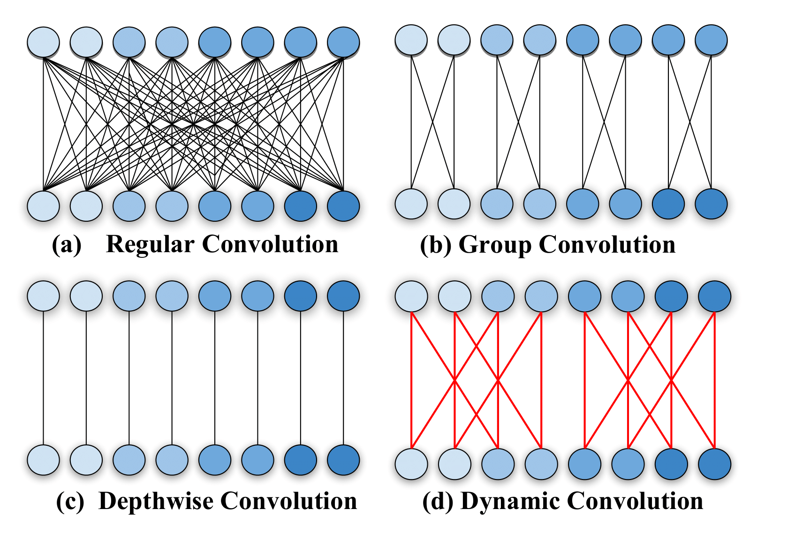
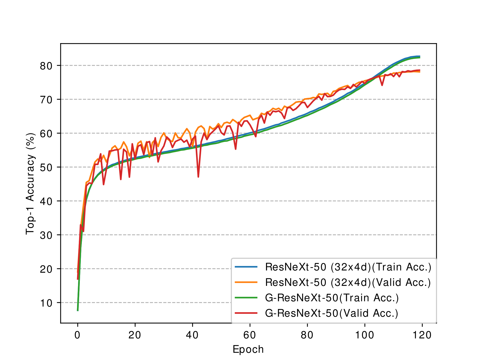

# dgconv.pytorch
PyTorch implementation of Dynamic Grouping Convolution and Groupable ConvNet in [Differentiable Learning-to-Group Channels via Groupable Convolutional Neural Networks](https://arxiv.org/abs/1908.05867).



* *Kronecker Product* is utilized to construct the sparse matrix efficiently and regularly.
* Discrete optimization is solved with the *Straight-Through Estimator* trick.
* Automatically learn the number of groups in an end-to-end differentiable fashion.

## ResNeXt-50 on ImageNet

**DGConv** is used as a drop-in replacement of depthwise separable convolution in the original ResNeXt to build G-ResNeXt-50/101 network architectures. Here are some results of their performance comparison.

| Architecture                                                 | LR decay strategy   | Top-1 / Top-5 Accuracy |
| ------------------------------------------------------------ | ------------------- | ---------------------- |
| [ResNeXt-50 (32x4d)](https://drive.google.com/open?id=1zVQm-aoJV6GRi-mCds7B8HVcsI8Jbjim) | cosine (120 epochs) | 78.198 / 93.916        |
| [G-ResNeXt](https://drive.google.com/open?id=1elM-FVacE-Pkin_hCiW24oKCogHEaYRn) | cosine (120 epochs) | 78.592 / 94.106        |



## Citation

```bibtex
@InProceedings{Zhang_2019_ICCV,
author = {Zhang, Zhaoyang and Li, Jingyu and Shao, Wenqi and Peng, Zhanglin and Zhang, Ruimao and Wang, Xiaogang and Luo, Ping},
title = {Differentiable Learning-to-Group Channels via Groupable Convolutional Neural Networks},
booktitle = {The IEEE International Conference on Computer Vision (ICCV)},
month = {Oct},
year = {2019}
}
```

